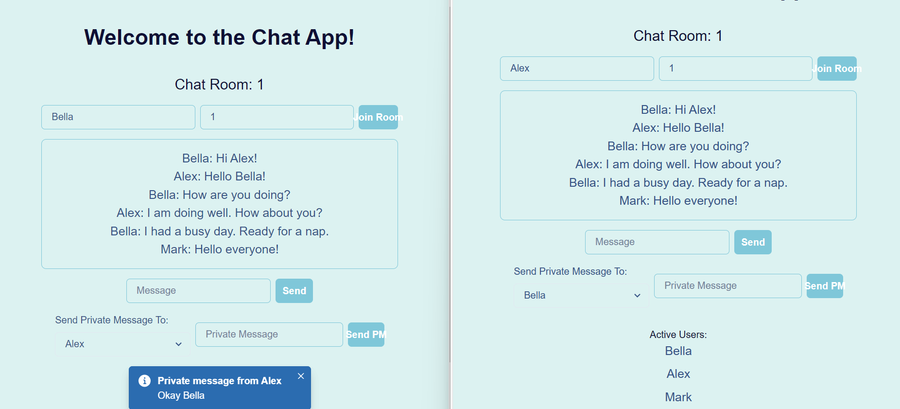

# Chat App Frontend

This is the frontend for the Chat App, a real-time messaging platform built with React and Chakra UI. 

[](LICENSE)
[](https://github.com/blockchaincyberpunk1/chat-app-client/stargazers)
[](https://github.com/blockchaincyberpunk1/chat-app-client/network/members)
[](https://github.com/blockchaincyberpunk1/chat-app-client/issues)
[](https://github.com/blockchaincyberpunk1/chat-app-client/pulls)

## Table of Contents

- [Chat App Frontend](#chat-app-frontend)
  - [Table of Contents](#table-of-contents)
  - [Introduction](#introduction)
  - [Features](#features)
  - [Installation](#installation)
  - [Usage](#usage)
  - [Contributing](#contributing)
  - [License](#license)
  - [Acknowledgments](#acknowledgments)


## Introduction

Chat App Frontend provides a sleek and intuitive interface for users to engage in real-time conversations. Utilizing modern web technologies, it offers a responsive and dynamic user experience.




## Features

The Chat App Frontend includes various features such as:

- **Real-Time Messaging**: Engage in conversations with other users in real-time.
- **Chat Rooms**: Join different chat rooms for various topics.
- **Private Messaging**: Send private messages to other users.
- **Responsive Design**: Enjoy a seamless experience on both desktop and mobile devices.

For a detailed guide on using these features, refer to our [User Manual](docs/user-manual.md).

## Installation

To set up the frontend on your local machine:

1. Clone the repository:

   ```bash
   git clone https://github.com/blockchaincyberpunk1/chat-app-client.git
   ```

2. Navigate to the project directory:

   ```bash
   cd chat-app/client
   ```

3. Install the required dependencies:

   ```bash
   npm install
   ```

4. Start the application:

   ```bash
   npm start
   ```

For additional setup instructions and troubleshooting, consult the [Installation Guide](docs/installation-guide.md).

## Usage

Once the application is running, you can access the Chat App in your web browser. Explore various chat rooms, send messages, and connect with others. Please refer to our [User Manual](docs/user-manual.md). 

## Contributing

Contributions to the Chat App frontend are welcome! If you have suggestions for improvements or encounter any issues, please feel free to open an issue or submit a pull request. Please check our [Contribution Guidelines](CONTRIBUTING.md) for details on how to get involved.

## License

This project is open-sourced under the MIT License. See the LICENSE file for more details.

## Acknowledgments

Special thanks to the React and Socket.IO communities for their invaluable resources and support.